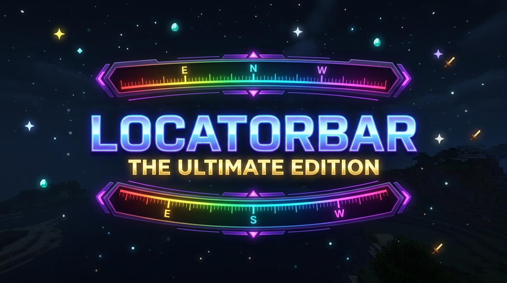

<div align="center">
  

  # LocatorBar — The Ultimate Edition 🌟

  <p><strong>An advanced RPG & MMO-style HUD compass and player/waypoint locator bar for Minecraft!</strong></p>

  <p>
    <a href="https://modrinth.com/mod/locatorbar-ultimate"></a>
    
    
  </p>
</div>

---

## ⚡ Features

### 🧭 Dynamic Degree Numbers & Intercardinal Ticks
* Continuous smooth degree tick marks along the bar ($15^\circ$ & $30^\circ$ increments).
* Cardinal & Intercardinal points: **N (0°)**, **NE (45°)**, **E (90°)**, **SE (135°)**, **S (180°)**, **SW (225°)**, **W (270°)**, **NW (315°)**.

### 🎯 Off-Screen Edge Indicators (`◄` / `►`) & Target Acquisition Glow
* When a tracked waypoint or friend is outside your field of view or behind you, subtle glowing arrow carets (**`◄`** on left / **`►`** on right) show which direction to turn.
* **Target Lock Glow**: When aiming directly toward a target ($\pm 2.5^\circ$), a gentle pulse glow confirms you are on target.

### 📍 In-Game Instant Waypoint Creator Hotkey (`B`)
* Press **`B`** anywhere in-game to open the interactive **Waypoint Creator** popup!
* Choose custom names, 12 icons (`★`, `⌂`, `☠`, `💎`, `⚔`, `🏰`, `🌲`, `📍`, `🚩`, `⛏`, `❤️`, `⚡`), and custom color swatches.
* Automatically saved in `config/locatorbar_custom_waypoints.json` without needing compasses.

### 🌈 8+ Visual Themes & Animated Chroma RGB Wave
* **Chroma RGB Wave**: Smooth animated rainbow wave flowing across the HUD.
* **Cyberpunk Neon**: Glowing hot pink & electric cyan.
* **Sunset Twilight**: Warm twilight orange-to-purple.
* **OLED Minimal**: Floating markers with zero background clutter.
* Plus: **Frosted Glass**, **Neon Cyan**, **Amethyst**, **Emerald**, **Gold**, and **Nether Crimson**.

### 🔊 Custom Audio Sound Packs & Fade Transitions
* Toggle audio feedback: *Modern Chime, Sci-Fi Blip, Mechanical Click, Level Up Ding, or Mute*.
* Smooth customizable fade-in and fade-out animation when toggling the bar.

### 🖱️ Interactive Drag-and-Drop HUD Position Editor
* Move and place the bar anywhere on your screen with grid snapping.

---

## 📦 Supported Loaders & Minecraft Versions

* **Fabric & Quilt**: `1.20` – `26.2`
* **NeoForge & Forge**: `1.20` – `1.21.4`
* **Paper / Spigot / Purpur / Folia Server Plugin**: `1.20` – `26.2+`

---

## ⌨️ Default Controls

| Keybind | Action | Description |
| :--- | :--- | :--- |
| **`K`** *(or `Numpad 0`)* | **Toggle Locator Bar** | Turn the locator bar HUD on or off |
| **`B`** | **Create Waypoint** | Open the instant waypoint creator modal |

*Keybindings can be customized anytime in **Options $\rightarrow$ Controls $\rightarrow$ Key Binds $\rightarrow$ Locator Bar**.*

---

## 📜 Copyright & License

```
LocatorBar: The Ultimate Edition
Original Mod Copyright (C) 2026 FuzjaJadrowa (https://github.com/FuzjaJadrowa/LocatorBar)
Enhanced Ultimate Edition Copyright (C) 2026 Krylo_plays (https://github.com/Krylo-60)

This program is free software: you can redistribute it and/or modify
it under the terms of the GNU General Public License as published by
the Free Software Foundation, either version 3 of the License, or
(at your option) any later version.

This program is distributed in the hope that it will be useful,
but WITHOUT ANY WARRANTY; without even the implied warranty of
MERCHANTABILITY or FITNESS FOR A PARTICULAR PURPOSE. See the
GNU General Public License for more details: https://www.gnu.org/licenses/gpl-3.0.html
```

* **Original Creator**: [FuzjaJadrowa](https://github.com/FuzjaJadrowa/LocatorBar)
* **Enhanced & Maintained by**: [Krylo_plays](https://github.com/Krylo-60)
* **License**: [GNU General Public License v3.0 (GPL-3.0)](https://www.gnu.org/licenses/gpl-3.0.html)